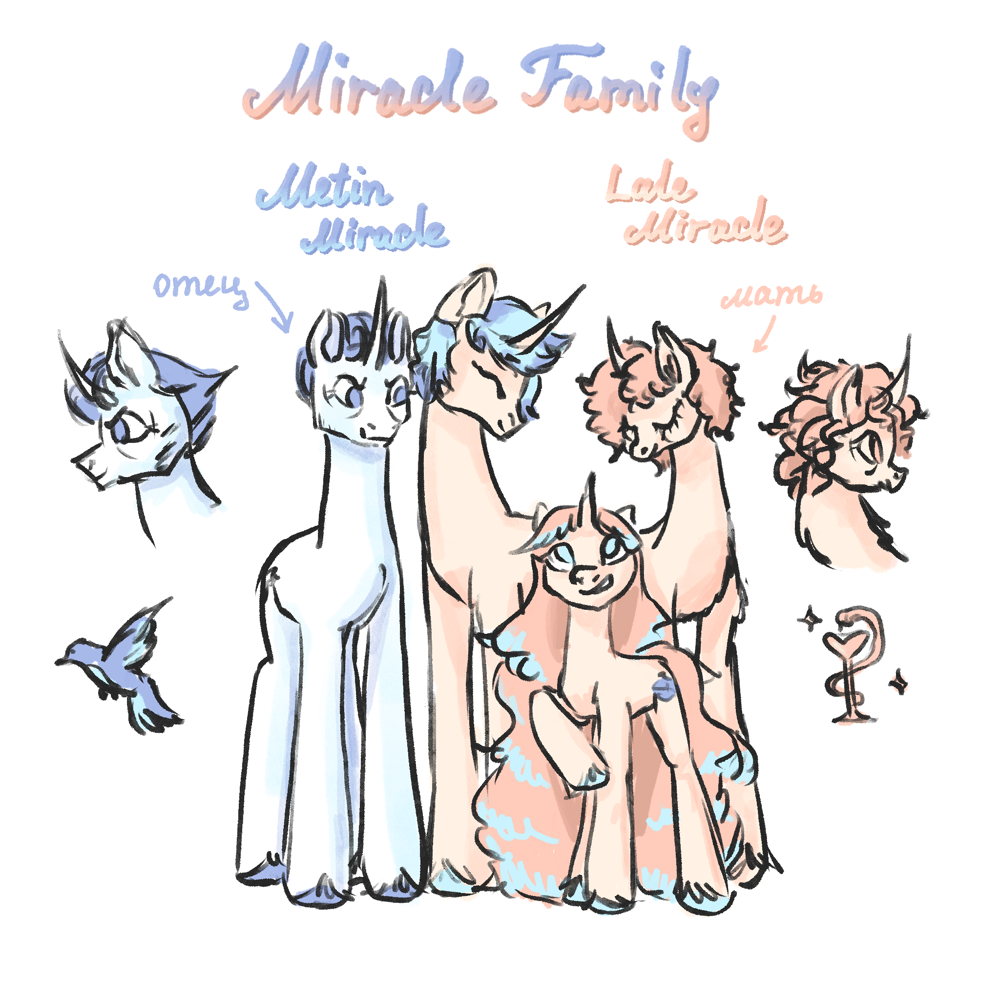
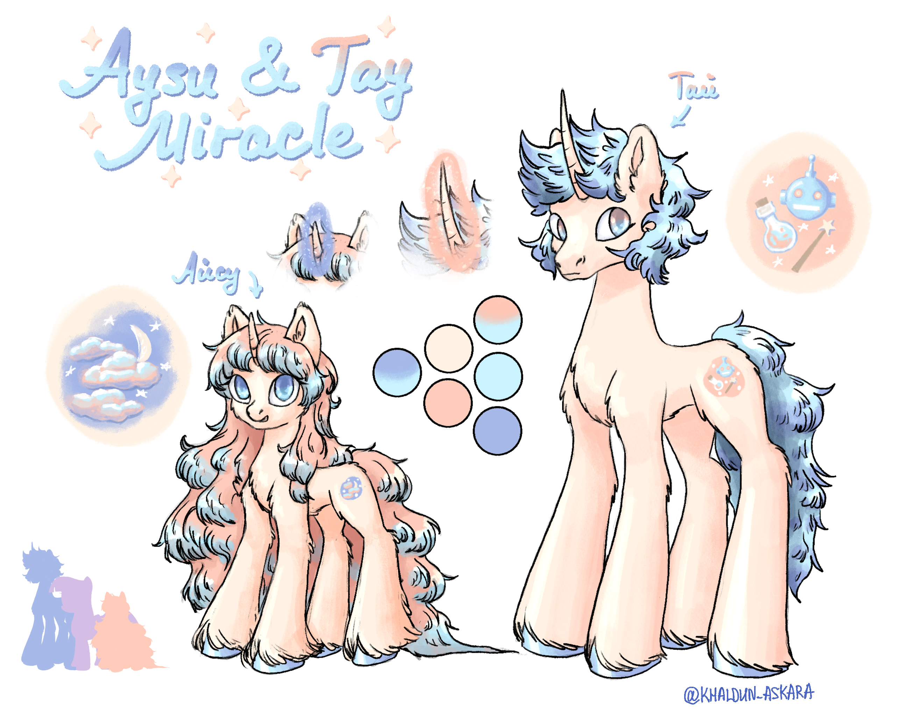

# Общее описание семьи

Предки семьи Миракл со стороны отца Тай и Айсу всегда были врачами, целителями и знахарями, и продолжать профессию родителей считалось само собой разумеющимся. Метин Миракл родился в непростые годы, когда количество посетителей в больнице их семьи было невероятно большим из-за локальной вспышки инфекции в их городе. Он с детства помогал родителям в их работе и учился у них на практике.
Лале рано потеряла родителей и попала в больницу семьи Миракл из-за болезни, но так как ей некуда было идти, врачи приютили её. Вместе с Метином они закончили школу и получили мед. образование, а позже создали семью и общий бизнес в медицинской сфере.

Сейчас семья Миракл владеет сетью медицинских центров, славящихся дорогим, но качественным обслуживанием. Также компания занимается благотворительностью и предоставляет медицинские услуги нуждающимся на бесплатной основе.

Сначала у Метина и Лале появился сын Тай, на которого отец возлагает большие надежды в продолжении семейного медицинского бизнеса, поэтому к нему было много требований и ожиданий, которые мальчик успешно оправдывал.
Младшая дочь Айсу появилась значительно позже, и её воспитывала по большей части мать, которая баловала её и уделяла много внимания.
На детей Лале и Метин не скупятся денег, поэтому Тай и Айсу жили в довольстве, получали поддержку во всех их начинаниях и хобби, а также получили отличное дорогое образование.

# Описание родителей (Метин и Лале Миракл) 

## Метин Миракл
Метин родился в семье врачей и с детства знал, кем будет и что ему для этого надо. Повседневные врачебные будни, которые были у него с детства, сделали его серьёзным, терпеливым и небрезгливым. Он видел многое за свою жизнь, не боится крови и различных физиологических подробностей, умеет держать себя под контролем и трезво мыслить.
Родители Метина были сильно заняты, когда он был маленьким, поэтому он очень самостоятелен и серьёзен, но ему явно не хватило внимания родителей. Он сильно сомневается в своей внешности, плохо проявляет эмоции и очень скупо общается. От родителей он научился лишь чувству долга и благородству, с которым он до сих пор упорно работает на должности главного врача сверхурочно в больнице и помогает всем, кому может.
Несмотря на внешнюю сдержанность и скупость эмоций, очень добр и умеет сострадать. Этих качеств он почему-то стесняется и ни за что не признается, что ему жалко любого жеребёнка, поцарапавшего коленку. Именно по его инициативе сеть медцентров Миракл имеет благотворительные программы.

Кьютимарка в виде голубя появилась, когда он осознал своё врачебное предназначение. Символизирует надежду и мир, который несут медики всем нуждающимся.

## Лале Миракл
Лале рано потеряла родителей из-за вспышки инфекции и сама сильно болела в детстве. Она была супермилым жеребёнком, и, ещё не осознавая своей внешней привлекательности для окружающих, умело этим пользовалась. Несмотря на потерю родителей, во внимании и заботе она не нуждалась, потому что все жалели сиротку, нянчились с ней и давали всё, что она хочет. Родители Метина, которые приютили кобылку после её выздоровления в их больнице, полюбили её как собственного ребёнка и старались дать ей как можно больше, несмотря на занятость. В итоге получалось так, что на собственного сына приходилось даже меньше времени.
Девочка помогала в больнице приютившим её Мираклам, училась состраданию и заботе об окружающих и закаляла свой характер ужасающими картинами эпидемии, в года которой выросла.
Лале активная и красивая, обладает сильными лидерскими и управленческими качествами. После смерти родителей Метина и перехода больницы в их руки приняла на себя роль главного управляющего больницей. Благодаря её таланту хорошая, но небольшая лечебница Мираклов превратилась в сеть медицинских центров.

Кьюти Лале также связана с медициной и символизирует её стремление развивать отрасль всеми силами. Появилась очень запоздало, так как Лале не особо пыталась понять, где она и что делает, а просто текла по течению. Но со временем при взрослении и понимании своих обязанностей в больнице и вещей, которые она должна делать, кьютимарка постепенно и совершенно незаметно для хозяйки появилась на боку.

# Айсу и Тай Миракл
 
## Тай Миракл
Родившийся наследником большого состояния Мираклов, Тай с детства прекрасно понимал свою роль и она его целиком и полностью устраивала.

С детства от мальчика требовали хорошо учиться и участвовать в профессиональной деятельности семьи, поэтому Тай знает обо всех аспектах работы сети медицинских центров Миракл и активно способствует её развитию со своей стороны.

В детстве мальчик по наставлению отца читал много книжек, и детская (а потом и взрослая) художественная фантастика захватила его своими идеями лучшего, более технологичного мира. Молодой единорог, одновременно знакомый с идеями роботостроения и читавший в семейной библиотеке Мираклов (издревле бывших знахарями) о различных чарах и зельях, даже не думал, что направление магического программирования в принципе не существует, и ему придётся изобретать всё с нуля. Он перерыл кучу литературы, ходил на курсы робототехники, магии для единорогов и всех-всех-всех, изучил все хотя бы немного прилегающие области знаний, но не нашёл то, что хотел. Поэтому с помощью родителей Тай открыл исследовательский центр, где изучает магию и изобретает новые способы её использования в робототехнике. Самым полезным применением своих открытий Тай считает протезирование и развивает это направление, помогая потерявшим конечности пони снова обрести подвижность. Помимо этого он разрабатывает различных роботов и кукол в качестве пет-проектов.

Отец Тая очень старался принимать активное участие в его воспитании, чтобы привить жеребёнку правильные с его точки зрения ценности и жизненные ориентиры. Он показывал сыну, что в мире много страдания, что нужно всем помогать, и что врач это тяжёлая и благородная профессия. Старания Метина не прошли даром, хоть он и подавал свои мысли в достаточно сухой и неэмоциональной форме, потому что по-другому не умел. Тай прислушивался к отцу и перенял у него очень много качеств, как хороших, так и плохих: он добр и сострадателен, но немногословен и неэмоционален. Тем не менее, в отличие от отца, он не стесняется показывать свою доброту окружающим и сострадает всем открыто. Между отцом и сыном существует глубокое взаимное уважение. Тай понимает, что отец немного старомоден и замкнут, но уважает его упорство и доброту, а Метин видит в сыне прогрессивного и очень способного мальца, которому не хватает опыта, но которому не страшно оставить больницу и пациентов.

Мать Тая относилась к сыну очень тепло и обеспечивала его всем необходимым во всех начинаниях. Именно она подарила ему первые книги про роботов и будущее, водила на научно-популярные выставки и покупала первые детали для детских поделок. В отличие от отца, она понимала значимость использования технологий в медицине и сильно продвигала эту тему у сына. Тай благодарен матери за возможности, которые были ему предоставлены, ведь без поддержки и солидных финансовых вложений его хобби, выросшее в полноценную отрасль знаний, не смогло бы так далеко продвинуться, если бы вообще появилось.

Кьютимарка Тая – это робот, волшебная палочка и эликсир. Её он получил, когда впервые оживил робота с помощью магии в достаточно раннем возрасте.

## Айсу Миракл
Айсу – это полностью маменькина дочка. Она очень похожа на маму и по характеру, и по внешности, отчего была явной любимицей всех остальных членов семьи. Её с детства много баловали и не требовали каких-то успехов, потому что старший брат был наследником, и поэтому милашка, не беспокоясь ни о чём, занимается в своё удовольствие всем, что ей интересно.

Несмотря на то, что на неё никто не давит, Айсу не хотела отставать от старшего брата тоже лезла в дела семьи, помогая в больнице родителям. Когда она впервые увидела, чем занимается брат, ей стало до жути интересно, и теперь она помогает ему, чем может.

По натуре своей Айсу очень легкомысленная и творческая, любит красивый визуал и считает, что можно сколько угодно делать функциональных роботов, но они должны быть ещё и красивыми. Её роль в проекте Тая творческая – она занимается дизайном и декором всего, что создаёт её брат, а также ведёт соцсети и занимается рекламой клиник и центров семьи Миракл. У неё отлично удаётся это, поэтому она весьма популярна в интернете и имеет множество подписчиков.

Айсу имела много внимания ото всех вокруг, поэтому она очень высокого мнения о себе, любит капризничать, выделываться и получать только самое лучшее. И так как у её родителей достаточно денег, самое лучшее она получает без проблем. О будущем пони совсем не волнуется, потому что знает, что брат не оставит её без доли наследства.

Метин почти не участвовал в воспитании Айсу, потому что всё время с ней проводила мама. Он любит дочку, но думает, что она слишком дурашливая и глупая и ей следует быть немного серьёзней. Айсу в свою очередь уважает отца, но особо к его советам не прислушивается.

С мамой у девочки отношения лучших подружек. Лале всегда поддерживала и ни в чём не отказывала своей дочке, поэтому та ей полностью доверяет и делится всем жизненными проблемами и радостями. Вместе пони проводят много времени даже после того, как Айсу выросла. У них есть общие занятия и хобби (например, вышивание и другое рукоделие), они понимают друг друга без слов и отлично ладят.

Кьютимарка Айсу проявилась с первой нарисованной росписью на протезе, который создал её брат. Она поняла своё предназначение – эстетическая составляющая лечения важна не меньше, чем лекарства, правильные процедуры и вспомогательные инструменты. Своим творчеством пони приносит красоту в этот мир вместе с пользой, которую делает её брат.

## Отношения Айсу и Тая
Тай, как более осознанный и старший ребёнок в семье, делает всё, чтобы Айсу жилось отлично. Он защищает её, радует и старается выполнять все просьбы, но делает это без маминого фанатизма. Завидовать девочке, как-то обижать её или делать ей плохо никогда не приходило ему в голову, потому что это огорчило бы и родителей, и знакомых семьи, да и причин этому нет. Лале отлично выдержала баланс внимания и любви к обоим детям, и хоть перекос в сторону Айсу очевиден, Тая это особо никогда не задевало, потому что ему ещё доставалось достаточно внимания отца.

Айсу никогда не задумывалась о чём-то таком и всегда принимала всё как само собой разумеющееся. В брате она видит надёжного друга, не такого как в маме, но тоже достаточно близкого и внушающего доверие.

Брат и сестра отлично сработались в общем бизнесе, и уже будучи взрослыми, очень хорошо общаются, сохраняя, впрочем, личные границы и не залезая в личную жизнь друг друга. Иногда у них возникают творческие и технические разногласия, которые решаются благодаря мягкости характера Айсу и здравому рассудку Тая.

В отличие от Метина, Тай не считает, что Айсу глупая или легкомысленная. У неё просто отличные ценности, и, с его точки зрения, она не пропадёт даже без денег родителей. Тем не менее, такую творчески развитую специалистку он очень ценит и понимает вклад девочки для больницы.

Айсу восхищается умственными и магическими способностями брата, потому что ей не так легко давалась учёба и магия. Она очень любит творения, которые создаёт её брат, и всегда очень старается, когда придумывает дизайны или делает росписи.
